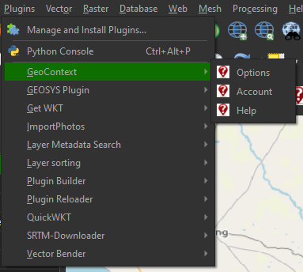
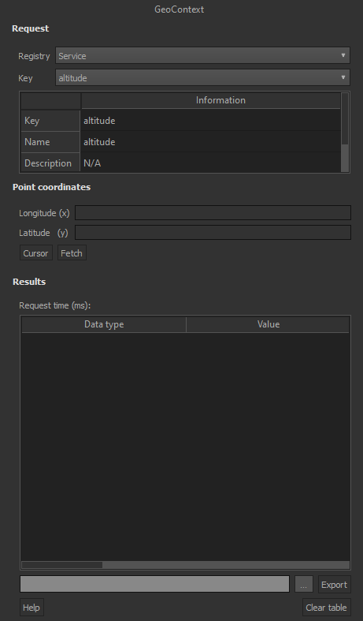

# GeoContext QGIS plugin

A QGIS plugin which retrieves data for a provided geographic position. Data is fetched from
the GeoContext data server which can make use of WMS and WFS. The plugin allows the user to
click in the QGIS map canvas, which will fetch the information for the location. Results are
shown in a table. Another feature of the plugin is a processing tool. The tool retrieves
values for each point in a point layer. Results are stored in the attribute in a newly created
layer. If any transformation are required it is automatically done by the plugin. The following
data option are available:
- Service: A single dataset (e.g. rainfall for January, temperature for December, etc.);
- Group: Service datasets of the type (e.g. rainfall, temperature, etc.); and
- Collection: All groups of the same category (e.g. climate)

Visit the GeoContext [home page](https://geocontext.kartoza.com) for more details.

This plugin is Free and Open Source Software and is released under the GPL V2.
See the LICENSE file included with the plugin (and in this repository) for
more information about this license.

# Installing the plugin

There are several approach to which a user can install a plugin:

## Plugin manager
This will be the easiest way to install the plugin:
1. Click on 'Plugins' -> 'Manage and install plugins' in QGIS;
2. Click on the 'All' tab; and

3. Click 'Install plugin'.

## ZIP file
A zip file of the plugin can be downloaded and installed as follows:
1. Go to the pluging gitHub repository: https://github.com/kartoza/GeoContextQGISPlugin;
2. Click on 'Code' -> 'Download ZIP';

3. In QGIS, click on 'Plugins' -> 'Manage and install plugins';
4. Click on the 'Install from ZIP' tab;
5. Select the plugin ZIP file; and
6. Click 'Install plugin'.

## Repository clone

The user can also directly clone the repository and manually copy it to the QGIS plugin folder:
1. Clone the reposity using git: 'git clone https://github.com/kartoza/GeoContextQGISPlugin';
2. Go to the QGIS plugins folder. It should be similar to 'C:\Users\USERNAME\AppData\Roaming\QGIS\QGIS3\profiles\default\python\plugins\GeoContextQGISPlugin',
   where USERNAME is your Windows username;
3. Copy the cloned folder to the plugin's folder; and
4. Enable the plugin in the QGIS Plugin manager. A QGIS restart might be required.

# Plugin guide
This section provides a short guide on how to use the plugin, ranging from how to use the panel, the processing tool,
and how to make changes to the option/settings of the plugin. Printscreens are also provided to make the guide
easy to understand.

## Plugin menu and toolbar
The toolbar can be used to open the GeoContext docking panel. The panel allows the user to select point locations using
the cursor. The figure which follows indicate, highlighted in red, the GeoContext toolbar.

To open the processing tool or the option's dialog for the plugin, the user can go to 'Plugins' -> 'GeoContext'.
Here is an example of the menu:

## Panel
This panel can be opened when clicking on the toolbar button. When the panel has been opened, the user can select a point
location using the cursor. The coordinates of the point location will be retrieved, which will then be used to perform
a request for the selected registry type and key name. Here is a quick explanation of each of the panel's features:
- Registry: Can be either 'Service', 'Group', or 'Collection';
- Key: The key name of the data the user wants to retrieve. The key name is used to retrieve
the key ID, which is then used to perform the request;
- Information table: Shows details related to the selected registry type and key;
- Longitude: This is the x-coordinate of the selected location;
- Latitude: This is the y-coordinate of the selected location;
- Cursor: Can be used to enable or disable the canvas point tool cursor. The user won't be 
to select points using the cursor if this is disabled;
- Fetch: Does a request for the location, and selected data;
- Results table(s): Results from the performed request;
- Export: Export the results in the table to a geopackage (gpkg); and
- Clear table: Clears the table of any content.

## Processing tool
The processing tool can be accessed via the QGIS toolbox. This tool allows the user to provide a point vector file as input to perform requests with. A request
will be performed for each of the points contained by the vector layer. Any points with no geometry will be ignored.
Here is a quick explanation on the parameters of the tool:
- Point layer: This is the input layer which contains the points for which requests will be made. This can
only be a point vector layer;
- Selected features only: If the user has selected features of the input layer, the processing
will only perform on the selection;
- Endpoint URL: Base URL used to perform requests. This can be changed in the options;
- Schema configuration: The link used to retrieve the schema docs. This can be changed in the options;
- Registry: The registry type, either 'Service', 'Group', or 'Collection';
- Key: The key name. This name will be used to retrieve the key ID, which in turn is used to perform the request;
- Field name/prefix: This is the field name/prefix for the field(s) which will be added. At least one character
needs to be provided;
- Output point file: The newly created file. Can either be geopackage (gpkg) or shapefile (shp); and
- Open output file after running algorithm: If the processing is successful the newly created point file
will be added to the QGIS map canvas.

### Results from processing tool
The figure which follows show the extracted elevation values for points. This has been obtained using 'Service'
registry type.

Notable is that the attribute table which follows contains a large number of added values/attributes. This is because
the request were done on a 'Collection', in this case on 'Global climate collection' - the results therefore
contains several attributes, e.g. bioclimatic conditions, rainfall, temperature, etc. 

## Options dialog

The option's dialog is used to set the settings for the plugin. It can be accessed by clicking on 'Plugins' -> 
'GeoContext' -> 'Options'. Here is a quick explanation of the available options:
- API configuration:
  - Endpoint URL: Base URL used to request data;
  - Schema configuration: URL used to retrieve the docs schema.
- Global settings:
  - Request CRS: This should be set to the coordinate system on which the requests need to be made. Coordinates
  will therefore be transformed to this CRS when required. Available CRSs:
    - WGS84 (EPSG:4326).
- Panel settings:
  - Decimal places: The number of decimal plcaes which will be used for numberic values when performing
  panel requests;
  - Automatically clear table: If enabled, everytime a user clicks in the canvas for a location request,
  the table will be cleared. If disabled the request values will stack in the table. The 'Clear table'
  button can still be used to clear the table.
- Processing tool settings:
  - Decimal places: The number of decimal places which will be used for numeric values when storing the
  results in the point layer attribute table.

# Contributing

If you would like to contribute an enhancement, bug fix, translation etc. to
this plugin, please make a fork of the repository on Github at:

https://github.com/kartoza/GeoContextQGISPlugin

Then make your improvements and make a Github pull request. Please follow
the existing coding conventions if you want us to include your changes.

## This plugin was implemented by:

**Kartoza (Pty) Ltd.**
https://kartoza.com/

**Divan Vermeulen**
divan@kartoza.com

